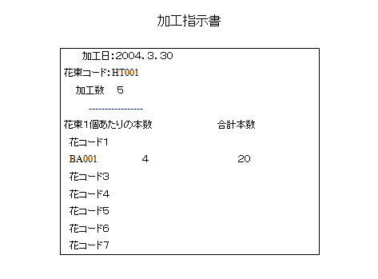

## 加工・出荷

```
workflow 注文を加工する
    trigger:
        "お届け日の前日になった" event
    input:
        加工指示書
    output:
        "注文の加工が完了した" event
    side-effect:
        unknown

workflow 注文を出荷する
    trigger:
        "お届け日になった" event
    input:
        加工された注文
    output:
        "注文の出荷が完了した" event
    side-effect:
        顧客へ出荷確認メール

data 加工指示書
    花束コード
    加工数
    加工日

data 加工された注文
    加工情報
        加工日時
    注文

data 出荷された注文
    出荷情報
        出荷日時
    注文
```


