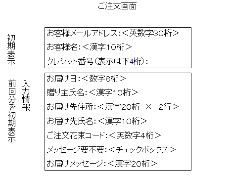

## 注文

```
workflow 花束を注文する
    trigger:
        "注文フォームを受け取った" event
    input:
        注文フォーム
    output:
        "注文を確定した" event
    side-effect:
        注文確認を顧客に送る

data 注文
    顧客情報
    お届け日
    贈り主氏名
    お届先住所1
    お届先住所2
    花束コード
    花束の数

data 顧客情報
    お客様メールアドレス
    お客様名
    (クレジット番号)

data メッセージ付きの注文
    花束の注文 and
    お届けメッセージ
```


